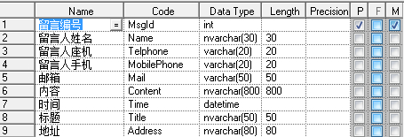
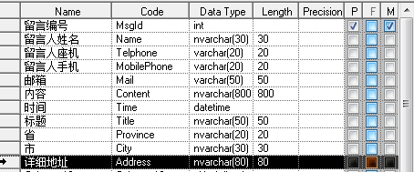
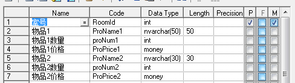
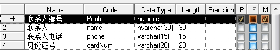

# 一、第一范式

1. 每一列属性都是不可再分的属性，确保每一列的原子性。

2. 每一列属性相似或相近，尽量合并到一列，确保不会产生冗余数据。

   	

   	

   如果需求知道那个省那个市并按其分类，那么显然第一个表格是不容易满足需求的，也不符合第一范式。

   	

   	

   显然第一个表结构不但不能满足足够多物品的要求，还会在物品少时产生冗余。也是不符合第一范式的。

   # 二、第二范式

   每一行的数据只能与其中一列相关，即一行数据只做一件事。只要数据列中出现数据重复，就要把表拆分开来。

   	

   一个人同时订几个房间，就会出来一个订单号多条数据，这样子联系人都是重复的，就会造成数据冗余。我们应该把他拆开来。

   	

   	

   这样便实现啦一条数据做一件事，不掺杂复杂的关系逻辑。同时对表数据的更新维护也更易操作。

   # 三、第三范式

   ​	数据不能存在传递关系，即没个属性都跟主键有直接关系而不是间接关系。像：a-->b-->c  属性之间含有这样的关系，是不符合第三范式的。

   ​	比如Student表（学号，姓名，年龄，性别，所在院校，院校地址，院校电话），这样一个表结构，就存在上述关系。 学号--> 所在院校 --> (院校地址，院校电话)，这样的表结构，我们应该拆开来，如下：

   （学号，姓名，年龄，性别，所在院校）--（所在院校，院校地址，院校电话）

   # 四、反范式

   ​    **所谓反范式**，故名思义，跟范式所要求的正好相反，在反范式的设计模式，我们可以允许适当的数据的冗余，用这个冗余去取操作数据时间的缩短。**也就是利用空间来换取时间**,把数据冗余在多个表中，当查询时可以减少或者是避免表之间的关联
   
   # 五、总结
   
   ​	三大范式只是一般设计数据库的基本理念，可以建立冗余较小、结构合理的数据库。如果有特殊情况，当然要特殊对待，数据库设计最重要的是看需求跟性能，需求>性能>表结构。所以不能一味的去追求范式建立数据库。